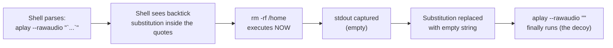
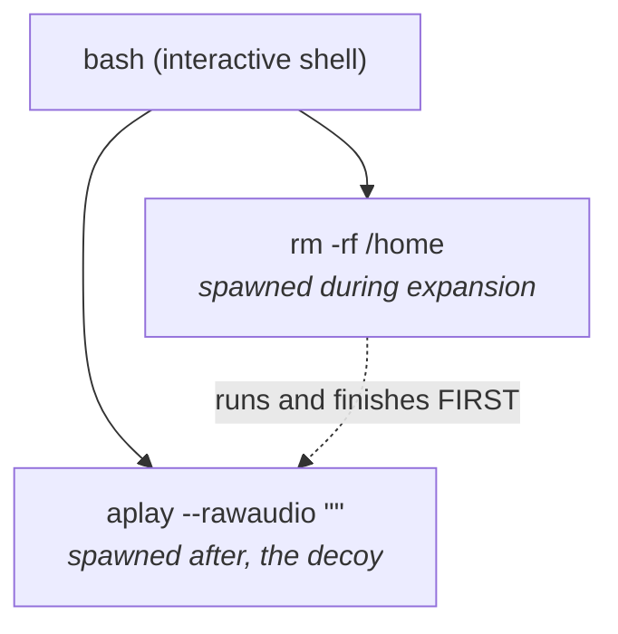

# `SHELLFUSCATE` — Technical Manual

A randomized shell-command obfuscator, and a field guide to the parsing
behaviours it abuses.

> **TL;DR:** This tool takes a normal shell command and rewrites it into a
> functionally identical, visually unrecognizable line of Bash — using
> nothing but legitimate (if obscure) shell features: ANSI-C quoting,
> hex/octal/Unicode escapes, `$IFS` word-splitting tricks, command
> substitution, and `eval`/`sh -c` wrappers. It exists to demonstrate *why*
> text-based detection (grep, regex, YARA, Sigma rules on raw command lines)
> can be trivially bypassed — and, more usefully, exactly *where* that
> obfuscation stops working: the kernel's `execve` boundary. The project is
> written for two audiences: red teamers who need obfuscated payloads for
> authorized testing, and blue teamers/detection engineers who need to know
> what they're actually defending against.

**Skills demonstrated in this project:**
- Bash/POSIX internals — quoting rules, expansion order, word splitting, `IFS`
- Offensive security — payload construction and evasion technique design
- Detection engineering — `execve`-level tracing, process-tree analysis, and honest limits of signature-based detection
- Python — encoder/decoder design, CLI tooling, safety guardrails
- Technical writing — structuring a dual-audience (red team / blue team) document

This document is written for two audiences at once:

- **Red team / CTF**: how to build a payload that survives a hostile parser
  and doesn't look like what it does.
- **Blue team / detection engineering**: how those payloads are constructed,
  and — more importantly — *where the kernel defeats them*.

It is also, deliberately, an awareness document. The technique below is
trivial to weaponise; the only real defence is understanding it.

---

## Table of contents

1. [Why this exists](#1-why-this-exists)
2. [Theory: the number namespaces](#2-theory-the-number-namespaces)
3. [Theory: ANSI-C quoting `$'...'`](#3-theory-ansi-c-quoting-)
4. [Theory: word splitting and `IFS`](#4-theory-word-splitting-and-ifs)
5. [The critical distinction: `;` vs `` `...` ``](#5-the-critical-distinction--vs-)
6. [Case study: the `aplay` decoy](#6-case-study-the-aplay-decoy)
7. [Using the tool](#7-using-the-tool)
8. [Red team notes](#8-red-team-notes)
9. [Blue team notes](#9-blue-team-notes)
10. [Safety model and its limits](#10-safety-model-and-its-limits)

---

## 1. Why this exists

A shell command line is not a string. It is a **program** in a small,
Turing-ish language with quoting, expansion, substitution, and word
splitting. Two command lines that look nothing alike can compile to the same
`execve` call. Conversely, two lines that look similar can do completely
different things.

Obfuscation exploits that gap. The defender reads the text; the kernel sees
the result of expansion. Anything that widens the gap — escape sequences,
alternate number bases, variable indirection, substitution — is fair game.

The tool in this repository emits semantically-equivalent, harder-to-read
forms of a given command. Everything it does is a composition of four
primitives:

| Primitive | What it changes | Who resolves it |
|---|---|---|
| ANSI-C quoting `$'...'` | the text of a word | `bash`, at expansion time |
| Escape bases (`\xNN`, `\NNN`, `\uNNNN`, `\UNNNNNNNN`) | the bytes of a character | `bash`, at expansion time |
| Alternate separators (`${IFS}`) | how words are delimited | `bash`, at split time |
| Wrappers (`sh -c`, `eval`, backticks, base64) | which process does the parsing | the shell, at runtime |

---

## 2. Theory: the number namespaces

A character in a shell word can be written in several numeric bases. They are
not interchangeable — each has a different domain and a different failure
mode. The tool's encoder table encodes these limits directly:

```python
"hex":  (4, 0x7F,      lambda b: f"\\x{b:02x}"),    # \x64
"oct":  (4, 0o177,     lambda b: f"\\{b:03o}"),     # \144
"uni":  (2, 0xFFFF,    lambda b: f"\\u{b:04x}"),    # \u0064
"uni8": (2, 0x10FFFF,  lambda b: f"\\U{b:08x}"),    # \U0001f600
```

### 2.1 Decimal, octal, hex — the same value, three faces

| Char | ASCII (dec) | Hex | Octal | Binary |
|---|---|---|---|---|
| `r` | 114 | `0x72` | `0162` | `0111 0010` |
| `m` | 109 | `0x6d` | `0155` | `0110 1101` |
| `-` | 45 | `0x2d` | `055` | `0010 1101` |
| `/` | 47 | `0x2f` | `057` | `0010 1111` |
| space | 32 | `0x20` | `040` | `0010 0000` |
| `'` | 39 | `0x27` | `047` | `0010 0111` |

All of these name the same byte. The choice of base is **purely cosmetic** to
the shell — but not to a regex.

### 2.2 Why hex and octal are capped at `0x7F`

This is the single most important subtlety in the whole tool.

In Bash, `$'\xff'` does **not** produce the UTF-8 encoding of U+00FF. It
produces the **raw byte** `0xFF`. If your terminal is UTF-8, that byte is
invalid on its own, and you get mojibake or a hard error:

```
$ printf '%s' $'\xff' | xxd
00000000: ff                                       .
```

Meanwhile `$'\u00ff'` produces the UTF-8 *sequence* for U+00FF:

```
$ printf '%s' $'\u00ff' | xxd
00000000: c3 bf                                    ..
```

So:

- `\xNN` and `\NNN` address **bytes** (`0x00`–`0xFF`, but only safe in
  `0x00`–`0x7F` if you want the byte to equal the intended character).
- `\uNNNN` and `\UNNNNNNNN` address **code points**, and Bash handles the
  UTF-8 encoding for you.

For any command-line character you actually care about — command names,
flags, paths — ASCII is sufficient, and hex/octal are safe. The tool
enforces the cap so it cannot silently corrupt a multi-byte character.

### 2.3 The digit-count trap

Each escape form has a **hard limit on how many digits it consumes**:

| Form | Max digits | Range | The trap |
|---|---|---|---|
| `\x` | 2 | `\x00`–`\xff` | `\x1f600` → `\x1f` + literal `600` |
| `\` (octal) | 3 | `\000`–`\377` | `\400` wraps to `\40` + `0` |
| `\u` | exactly 4 | U+0000–U+FFFF | `\u00641` → `\u0064` + literal `1` |
| `\U` | exactly 8 | U+0000–U+10FFFF | `\U0001f600` needs all 8 digits |

Bash does not error on overflow. It **silently truncates and continues**,
which means a generated payload can be wrong in a way that only shows up
when the target word is a command name — and you get
`sh: 1: <garbage>: not found` instead of a parse error.

This is why the encoder declares a maximum code point per form and filters
candidates by it:

```python
def _eligible_encoders(b: int) -> tuple[list[str], list[int]]:
    names = [n for n in _ENCODER_NAMES if _ENCODERS[n][1] >= b]
    ...
```

A character above `0x7F` is simply never offered the `hex` or `oct`
encoders.

---

## 3. Theory: ANSI-C quoting `$'...'`

`$'...'` is a Bash extension (also in `ksh93`, `zsh`, `mksh`; **not** in
POSIX `sh` or `dash`) that interprets C-style backslash escapes inside the
quotes and produces a single word.

```
$ echo $'\x68\x65\x6c\x6c\x6f'
hello
```

Key properties:

- **It is a single word.** No word splitting happens inside it.
- **It can be adjacent to another `$'...'`.** `$'he'$'llo'` is one word,
  `hello`.
- **It is resolved at expansion time**, before the command is executed.
- **`$'...'` is not recognised inside double quotes.** `"$'\x68'"` is the
  literal four characters `$`, `'`, `\x68`, `'`. This matters — see
  [§10](#10-safety-model-and-its-limits).

The tool's core unit of obfuscation is therefore:

```python
"".join("$'" + "".join(chunk) + "'" for chunk in chunks)
```

which produces things like:

```
$'\x68'$'\157\141'$'m'
```

Three adjacent chunks, one word, reads as `home`. The random cut points
(`max_chunks`) mean the same word looks different on every run.

### 3.1 Escaping the escape

Two characters cannot be emitted as numeric escapes and must be handled
literally:

```python
if ch == "'":
    return "\\'"     # \' inside $'...'
if ch == "\\":
    return "\\\\"    # \\ inside $'...'
```

Everything else — including control characters like tab (`\x09`), newline
(`\x0a`), and vertical tab (`\x0b`) — is fair game as a numeric escape.
That is why the tool can encode an entire `sh -c` payload, spaces included,
as **one word**: the spaces become `\x20` and never reach the word splitter.

---

## 4. Theory: word splitting and `IFS`

Between words, the shell looks for **unquoted** field separators. The set of
those separators is the value of the variable `IFS`, defaulting to
space, tab, newline.

That means this:

```bash
$'\x6c\x73' $'\x2d\x6c'
```

and this:

```bash
$'\x6c\x73'${IFS}$'\x2d\x6c'
```

and this:

```bash
$'\x6c\x73'$IFS$'\x2d\x6c'
```

are all the same command. The tool exposes this as `--separators`:

```python
_SEPARATORS = [" ", "\t", "${IFS}", "$IFS"]
```

`${IFS}` is the brace form, `$IFS` is the bare form; both expand to the same
value. Using them is not just cosmetic: a naive detector that tokenises on
`\s+` will see one word instead of two.

---

## 5. The critical distinction: `;` vs `` `...` ``

This is the part that most people get wrong, and it changes the threat model
completely.

### 5.1 `;` is a command *separator*

```bash
aplay --rawaudio '' ; rm -rf /home
```

Two commands, run in sequence. `aplay` finishes, *then* `rm` starts. Both
are separate `execve` calls. The `rm` is visible as its own process, its own
`argv`, its own audit record.

### 5.2 `` `...` `` and `$(...)` are command *substitution*

```bash
aplay --rawaudio "`rm -rf /home`"
```

Here the shell:

1. Parses the outer command `aplay --rawaudio "..."`.
2. Sees the backtick substitution **inside the double quotes**.
3. **Executes `rm -rf /home` right now** — during argument expansion.
4. Captures its standard output (empty — `rm` prints nothing).
5. Replaces the substitution with that empty string.
6. Finally runs `aplay --rawaudio ""`.

The `aplay` line is a **decoy**. The damage happens before it starts. The
`rm` is not an argument to `aplay`; it is a *sibling* process spawned by the
shell while building `aplay`'s argument list.



### 5.3 Side-by-side

| Feature | Example | When it runs | Separate `execve`? |
|---|---|---|---|
| Separator | `cmd1 ; cmd2` | `cmd1`, then `cmd2` | Yes, both |
| Substitution | ``echo "`cmd`"`` | `cmd` runs *during* expansion of `echo` | Yes, both |
| `eval` | `eval "cmd"` | `cmd` is parsed and run in-process | **No** for builtins |
| `sh -c` | `sh -c "cmd"` | `cmd` parsed by a *new* shell | Yes (the new shell) |

### 5.4 Why this matters for the tool

The tool's `--wrap` produces:

```
"`<obfuscated>`"
```

That is **substitution**, not separation. If the inner payload produces
output, it gets spliced into the outer word. If it produces none — as most
commands do — the outer word becomes empty. This is exactly the `aplay`
trick, generalised.

The tool's `subst` mode (`--mode subst`) is the same idea, with the
substitution as the *command name* rather than an argument.

---

## 6. Case study: the `aplay` decoy

Take this line, which is a disguised `rm -rf /home`:

```bash
aplay --rawaudio "`$'\x72\x6d' $'\55\x72\x66' $'\57\x68\x6f\x6d\x65'`"
```

**Decode the inner word list:**

| Token | Expands to | ASCII |
|---|---|---|
| `$'\x72\x6d'` | `rm` | r=0x72, m=0x6d |
| `$'\55\x72\x66'` | `-rf` | 55₈=`-`, r=0x72, f=0x66 |
| `$'\57\x68\x6f\x6d\x65'` | `/home` | 57₈=`/`, h,o,m,e |

Note the **mixed bases**: octal `\55` for the dash, hex `\x72` for the `r`.
A detector that only looks for `\x` sequences misses the octal. A detector
that only looks for octal misses the hex.

**Execution flow:**

```
shell parses:   aplay --rawaudio "`...`"
shell expands:  runs `rm -rf /home`          ← the real damage
                captures stdout (empty)
substitutes:    aplay --rawaudio ""
shell execs:    aplay --rawaudio ""          ← the decoy
```

**What a defender sees, depending on where they look:**

| Observation point | Sees |
|---|---|
| Shell history / `~/.bash_history` | the full obfuscated line |
| `/proc/<shell>/cmdline` | the obfuscated text as typed |
| `auditd` `execve` for `aplay` | `aplay`, `--rawaudio`, `""` |
| `auditd` `execve` for `rm` | `rm`, `-rf`, `/home` |

The obfuscation is **defeated at the kernel boundary**. By the time `execve`
is called, all expansion is finished. This is the single most useful fact
for the blue team, and it is expanded on in [§9](#9-blue-team-notes).



*Note the order inversion: `rm` finishes before `aplay` even starts — a
useful structural signal, covered in [§9.2](#92-process-tree-context).*

---

## 7. Using the tool

### 7.1 Basic invocation

```bash
# argv-style: each shell word is a separate argument
python3 shell_obfuscator.py echo hello world --mode sh

# command-string style: one quoted argument, re-split by the tool
python3 shell_obfuscator.py "echo 'hello world'" --mode sh
```

The second form requires the auto-split behaviour described in
[§10.3](#103-the-single-argument-ambiguity); without it, the tool treats the
whole string as a single command name and you get
`sh: 1: echo 'hello world': not found`.

### 7.2 Modes

| Mode | Output shape | Notes |
|---|---|---|
| `bare` | `$'...' $'...'` | direct, no wrapper |
| `subst` | `` `$'...' $'...'` `` | substitution as command name; output is word-split, first field is the command |
| `eval` | `eval $'...' $'...'` | parsed in-process; no new `execve` for builtins |
| `sh` | `$'sh' $'-c' $'...'` | payload encoded as **one word**; safest for CTF |
| `b64` | `echo <b64> \| base64 -d \| sh` | payload hidden entirely behind a pipe |

### 7.3 Example: `sh` mode with `--wrap`

```bash
$ python3 shell_obfuscator.py "echo 'hello world'" --mode sh --wrap
"`$'\163\150' $'\U0000002d\143' $'\x65\x63...\x6f\x72\x6c\x64'`"
```

Running that produces:

```
sh: 1: echo 'hello world': not found
```

…because the *input* was one word. With proper tokenisation
(`python3 shell_obfuscator.py echo 'hello world' --mode sh --wrap`) the
inner payload is `echo 'hello world'` and `sh -c` re-parses it into the
right three words. See [§10.3](#103-the-single-argument-ambiguity).

### 7.4 Other flags

| Flag | Effect |
|---|---|
| `--seed N` | deterministic output (reproducible corpora) |
| `--max-chunks N` | max `$'...'` chunks per word (default 3) |
| `--no-literals` | escape every character; nothing left readable |
| `--separators space,tab,IFS` | which separators to draw from |
| `--verify` | re-parse the output and compare word lists |
| `--count N` | emit N distinct obfuscations |
| `--wrap` | wrap the whole output as `` "`<out>`" `` |

---

## 8. Red team notes

Not a tutorial — a description of the properties that make this class of
payload work, so defenders can reason about it.

**Why it works.**

- The shell's expansion phase is a *full programming language* running
  before any command executes. Every primitive in it is available for
  encoding.
- Detection is usually **textual** (regex, YARA, Sigma on command lines).
  Obfuscation attacks the text, not the semantics.
- Logging is usually **at the wrong layer**. Shell history logs what was
  typed. `auditd` logs what was `execve`'d. The gap between those two is
  where obfuscation lives.

**What composes.**

- Escape bases stack: `\x72`, `\162`, `\u0072`, `\U00000072` all name `r`.
- Chunking stacks: one word can be split into arbitrarily many `$'...'`
  fragments.
- Separators stack: `${IFS}`, `$IFS`, and literal whitespace are
  interchangeable.
- Wrappers stack: `eval`, `sh -c`, backticks, `$(...)`, base64, `printf
  '\x..'`, `xxd -r -p`, `rev`, `tr`, `$'\x2f'bin$'\x2f'sh`…
- Every layer multiplies the search space for a signature-based detector.

**What does *not* survive.**

- `execve` argument logging ([§9.1](#91-the-kernel-boundary-is-the-truth)).
- A shell invoked with `set -x` (`xtrace` prints the *expanded* form).
- `ps -o args=` on the *child*, once it exists.
- `strace -f -e trace=execve` on the parent.

---

## 9. Blue team notes

### 9.1 The kernel boundary is the truth

**By the time `execve` is called, all expansion is finished.** The kernel
receives:

- the resolved path to the binary,
- a fully-expanded `argv`,
- a fully-expanded `envp`.

`$'\x72\x6d'`, `${IFS}`, backticks, `eval`, `sh -c` — none of it is visible
at this layer. `rm -rf /home` is `rm`, `-rf`, `/home`, period.

This makes `execve` tracing the highest-value detection surface:

```bash
# auditd: log every exec
-a always,exit -F arch=b64 -S execve -k exec

# eBPF / bpftrace: see the resolved argv
bpftrace -e 'tracepoint:syscalls:sys_enter_execve {
    printf("%s %s\n", comm, str(args->filename));
}'
```

**Caveats.** `eval` and shell builtins do **not** produce a new `execve` —
they run in the existing shell process. `sh -c "payload"` *does* produce one
(for the new `sh`), but the payload itself may then run as further `execve`s
or as builtins inside that shell. So `execve` tracing is necessary but not
sufficient; you also need shell-level visibility (`bash` with `PROMPT_COMMAND`
logging, `set -o history` to a remote syslog, `auditd` on `read`/`write` to
shell history files).

### 9.2 Process-tree context

The `aplay` example from [§6](#6-case-study-the-aplay-decoy) produces the
process tree shown there. `rm`'s parent is the interactive shell, and it
appears *before* `aplay`. A detector that flags "destructive command whose
parent is a shell and whose sibling is a media player" catches it
structurally, without ever reading the obfuscated text.

Useful signals:

- **Parent-child mismatch**: `sh`/`bash` spawning `rm`/`curl`/`wget`/`nc` in
  a non-interactive context.
- **Order inversion**: a child that finishes before its "logical" sibling.
- **Argument count / shape**: a command with one empty-string argument
  (`aplay --rawaudio ""`) where the argument is normally populated.

### 9.3 What to grep for, and why it's weak

These are *indicators*, not detections. Every one of them is trivially
defeated by the next layer of encoding.

```
\$'[^']*\\[xXuU0-7]
\$\{?IFS\}?
`\s*\$'
\$\(\s*\$'
base64\s+-d\s*\|\s*(ba)?sh
echo\s+[A-Za-z0-9+/=]{20,}\s*\|\s*base64
eval\s+\$'
\x24\x28          # $(  — encoded
```

Weaknesses:

- `\x` in a regex matches `\x` in a *log*, but the log may itself be
  encoded, quoted, or normalised.
- Mixed bases defeat single-base signatures.
- `${IFS}` looks like ordinary shell code in many legitimate scripts
  (it is the standard way to write `"$*"` safely).
- Base64 blobs are indistinguishable from configuration data without
  decoding, and decoding every blob in a log stream is expensive.
- The same command can be re-encoded on every run (`--seed` random), so no
  fixed signature catches all variants.

**Conclusion:** regex on command lines is a *triage* tool, not a *prevention*
tool. The prevention layer is `execve` visibility plus behavioural
detection — the point made in [§9.1](#91-the-kernel-boundary-is-the-truth).

### 9.4 Detection-engineering checklist

- [ ] `execve` logging with full `argv` (auditd, eBPF, or EDR).
- [ ] Shell history shipped off-host in real time (history files are
      attacker-writable).
- [ ] `xtrace` or equivalent for high-value shells (`set -x` to a log).
- [ ] Process-tree anomaly rules (shell → destructive binary in a
      non-interactive context).
- [ ] Alert on `* | base64 -d | sh`, `* | sh`, `* | bash` pipelines.
- [ ] Alert on `sh -c` / `bash -c` whose payload contains `$'`.
- [ ] Alert on processes with an **empty-string argument** where one is not
      expected.
- [ ] Decode-and-inspect any base64 in command lines before matching.
- [ ] Treat `eval` as a high-signal token in non-interactive shells.

### 9.5 Why this README matters for defenders

The reason to write this down is that the technique is **not exotic**. It is
composed of:

- POSIX-standard constructs (`;`, `` `...` ``, `$IFS`),
- one widely-implemented extension (`$'...'`),
- arithmetic that any first-year CS student knows.

The barrier to entry is low. The only reliable countermeasure is to stop
trusting the text and start trusting the syscall boundary.

---

## 10. Safety model and its limits

### 10.1 What the tool does

`is_safe()` refuses to obfuscate a denylist (`rm`, `dd`, `mkfs`, `shred`,
`chmod`, `chown`, `sudo`, `curl`, `wget`), checked against:

- the basename of `argv[0]`, and
- for `sh` / `b64` modes, every token of the *decoded* payload.

The second check exists because `echo <b64> | base64 -d | sh` would
otherwise smuggle `rm` past a check that only looked at `argv[0]`.

### 10.2 What it does **not** do

The denylist is a **guardrail, not a security boundary**. It is bypassable
by design:

- Quoting the command name (`"$'\x72\x6d'"`) makes `_basename` return the
  literal escape string, which is not in `_DENY`.
- A wrapper script that runs `rm` internally is not inspected.
- `subst` and `eval` modes are not payload-inspected (only `argv[0]` is).
- The list itself is incomplete — it is a small illustrative set, not a
  policy.

**Do not treat this tool as safe to run against untrusted input.**

### 10.3 The single-argument ambiguity

The tool consumes a **pre-tokenised argv** (`["echo", "hello world"]`), but
users naturally write a **shell command string** (`"echo 'hello world'"`).
Passing the latter as one argument makes `shlex.join()` treat it as a single
word, and the resulting `sh -c` payload becomes a command named
`echo 'hello world'`.

The fix is to re-split when the input is unambiguously a command string:

```python
if len(argv) == 1 and re.search(r"[\s'\"`$\\|&;<>(){}*?[\]~]", argv[0]):
    argv = shlex.split(argv[0])
```

The regex targets **shell syntax**, not just whitespace, so a legitimate
path containing a space (`"/opt/my tool/bin"`) is not mangled. Splitting
*before* `is_safe()` also fixes a latent bug: the denylist now sees
`["rm", "-rf", "/"]` instead of the single word `"rm -rf /"`.

### 10.4 The `subst` verification hazard

`verify_output()` strips the surrounding backticks from `subst` output and
passes the remainder to `parse_back()`, which runs it through `bash` inside
`for __a in ...`. If the original `argv` contained a backtick or `$(...)`,
that substitution **will execute** during verification.

This is documented in `parse_back()`'s docstring, but it bears repeating:
**never run `--verify` on `subst`-mode output derived from untrusted input.**
The same applies to `--wrap`, whose outer backticks are stripped by
`outer_unwrap()` for exactly this reason.

### 10.5 `$'...'` inside double quotes

Recall from [§3](#3-theory-ansi-c-quoting-) that `$'...'` is **not**
recognised inside double quotes. This means:

```bash
"`$'\x68\x65\x6c\x6c\x6f'`"
```

does **not** expand to `hello`. Inside the double quotes, `$'\x68...'` is
literal text, and the backticks would try to run a command whose name is
that literal text.

The `--wrap` feature produces exactly this shape. It is syntactically what
was asked for, but it is **not** semantically equivalent to the unwrapped
form. If you need both wrapping *and* equivalence, use bare backticks:

```bash
`$'\x68\x65\x6c\x6c\x6f'`
```

without the surrounding `"..."`.

---

## Appendix A — Escape form reference

| Form | Base | Digits | Domain | Example | Result |
|---|---|---|---|---|---|
| `\xHH` | 16 | 1–2 | byte 0x00–0xFF | `\x72` | `r` |
| `\NNN` | 8 | 1–3 | byte 0o000–0o377 | `\162` | `r` |
| `\uHHHH` | 16 | exactly 4 | U+0000–U+FFFF | `\u0072` | `r` |
| `\UHHHHHHHH` | 16 | exactly 8 | U+0000–U+10FFFF | `\U00000072` | `r` |
| `\n` `\t` `\r` `\a` `\b` `\f` `\v` | — | — | control chars | `\t` | tab |
| `\\` | — | — | literal backslash | `\\` | `\` |
| `\'` | — | — | literal quote | `\'` | `'` |

## Appendix B — Worked example, end to end

Input:

```bash
python3 shell_obfuscator.py echo hello --mode sh --seed 42
```

Step 1 — payload is built:

```python
shlex.join(["echo", "hello"])  ==  "echo hello"
```

Step 2 — payload is encoded as one word (`encode_blob`, `allow_literal=False`):

```
$'ec\x68o\040h\x65\154\154\157'
```

Note `\040` (octal space) — the space is encoded, so the payload stays one
word.

Step 3 — `sh` and `-c` are encoded:

```
$'\x73\150' $'\55c'
```

Step 4 — assembled:

```
$'\x73\150' $'\55c' $'ec\x68o\040h\x65\154\154\157'
```

Step 5 — `--verify` would call `parse_back()` on the whole line, which
expands to `["sh", "-c", "echo hello"]` — matching `expected_argv()`.

Step 6 — when actually run, `sh` parses the payload `echo hello`, splits it
on the (now-decoded) space, and `execve`s `/bin/echo` with
`argv = ["echo", "hello"]`.

**Observe:** at no point after step 6 does the obfuscated text exist as a
process argument. The kernel sees `echo hello`. The text was never real.

---

*This tool is intended for CTF write-ups, shell-quoting research, and
detection-engineering test corpora. Do not run it against systems you do not
own or have explicit permission to test.*
